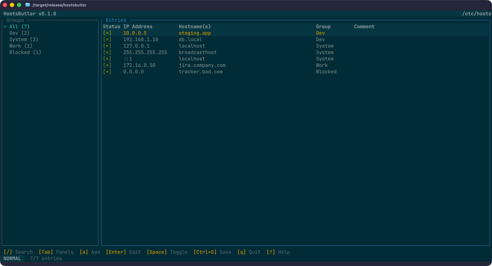
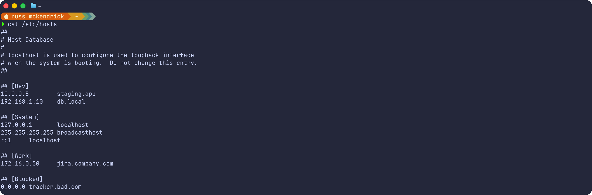
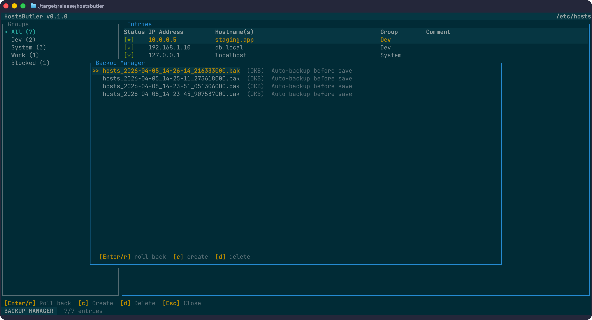

# HostsButler

A cross-platform TUI application for managing the system hosts file, built in Rust.




## Features

- **View and edit** hosts file entries in a keyboard-driven TUI
- **Enable/disable** entries without deleting them (comments/uncomments lines)
- **Group entries** with `## [GroupName]` headers for organisation
- **Search and filter** across IP, hostname, group, and comments
- **Automatic backups** before every save, with a backup manager for restore
- **Automatic DNS cache flush** after successful system hosts writes (best-effort)
- **DNS resolution testing** to verify entries match actual DNS
- **Import/export** in JSON, CSV, and hosts file formats from the CLI
- **Undo/redo** for all modifications
- **Read-only mode** for safe inspection without writes
- **Round-trip safe** parser that preserves comments, blank lines, and formatting
- **Cross-platform** support for macOS, Linux, and Windows

## Installation

### Homebrew (macOS)

The recommended way to install on macOS is via Homebrew:

```sh
brew install russmckendrick/tap/hostsbutler
```

To upgrade to the latest version:

```sh
brew upgrade hostsbutler
```

### GitHub Releases (Linux / Windows)

Pre-built binaries are available for all major platforms from the [GitHub Releases](https://github.com/russmckendrick/hostsbutler/releases) page.

#### Linux

Download and install using `curl`:

```sh
ARCH=$(uname -m | sed 's/x86_64/amd64/;s/aarch64/arm64/')
curl -sL "https://github.com/russmckendrick/hostsbutler/releases/latest/download/hostsbutler-linux-${ARCH}" -o hostsbutler
chmod +x hostsbutler
sudo mv hostsbutler /usr/local/bin/
```

#### Windows

Download using PowerShell:

```powershell
Invoke-WebRequest -Uri "https://github.com/russmckendrick/hostsbutler/releases/latest/download/hostsbutler-windows-amd64.exe" -OutFile "hostsbutler.exe"
```

You can then move `hostsbutler.exe` to a directory in your `PATH`, or run it directly from the download location.

### From source

```sh
cargo install --path .
```

### Build from source

```sh
git clone https://github.com/russmckendrick/hostsbutler.git
cd hostsbutler
cargo build --release
# Binary at target/release/hostsbutler
```

## Usage

```sh
# Launch TUI with system hosts file (may need sudo/admin)
sudo hostsbutler

# Open a specific hosts file
hostsbutler --file /path/to/hosts

# Import entries from JSON, CSV, or another hosts file
hostsbutler --file /path/to/hosts --import entries.json

# Export entries to JSON
hostsbutler --export entries.json

# Export entries to CSV
hostsbutler --export entries.csv

# Export as hosts file format
hostsbutler --export backup.hosts
```

### CLI Options

| Flag | Description |
|------|-------------|
| `-f, --file <PATH>` | Path to hosts file (overrides platform default) |
| `-r, --readonly` | Read-only mode; blocks edits, saves, backup mutations, and import |
| `--import <PATH>` | Import entries from JSON, CSV, or hosts format into the target hosts file |
| `--export <PATH>` | Export entries to file (format detected by extension: `.json`, `.csv`, or hosts) |

`--import` and `--export` are mutually exclusive.

## Keyboard Shortcuts

### Navigation

| Key | Action |
|-----|--------|
| `j` / `Down` | Move selection down |
| `k` / `Up` | Move selection up |
| `g` / `Home` | Jump to first entry |
| `G` / `End` | Jump to last entry |
| `Tab` | Switch focus between groups panel and entries table |

### Entry Actions

| Key | Action |
|-----|--------|
| `Space` | Toggle enable/disable |
| `a` | Add new entry |
| `e` / `Enter` | Edit selected entry |
| `d` | Delete entry (with confirmation) |

### Search

| Key | Action |
|-----|--------|
| `/` | Enter search mode |
| `Esc` | Exit search and clear filter |

Search supports prefix filters: `ip:192.168`, `host:example`, `group:dev`. Without a prefix, all fields are searched.

### File Operations

| Key | Action |
|-----|--------|
| `Ctrl+S` | Save file |
| `Ctrl+R` | Reload from disk |
| `Ctrl+Z` | Undo |
| `Ctrl+Y` | Redo |

### Other

| Key | Action |
|-----|--------|
| `b` | Open backup manager |
| `t` | Test DNS resolution for selected entry |
| `?` | Show help overlay |
| `q` | Quit (prompts to save if modified) |

## Entry Grouping

HostsButler recognises group headers in the hosts file using two formats:

```
## [Development]
192.168.1.10    dev.local
192.168.1.11    api.dev.local

# --- Production ---
10.0.0.1    prod.example.com
```

Groups appear in the left panel. Selecting a group filters the table to show only its entries. New entries can be assigned to groups and will be inserted in the correct position.



## Backups

Backups are created automatically before every save. The backup manager (`b`) lets you:

- View all backups with timestamps and sizes
- Restore any backup
- Create manual backups
- Delete old backups

Backups are stored as timestamped files with JSON metadata sidecars. A maximum of 20 backups are retained (oldest are rotated out).



### Backup locations

| Platform | Path |
|----------|------|
| macOS | `~/Library/Application Support/hostsbutler/backups/` |
| Linux | `~/.config/hostsbutler/backups/` |
| Windows | `%APPDATA%\hostsbutler\backups\` |

## Platform Support

| | macOS | Linux | Windows |
|---|---|---|---|
| Hosts path | `/etc/hosts` | `/etc/hosts` | `%SystemRoot%\System32\drivers\etc\hosts` |
| Privilege escalation | `sudo` | `pkexec` / `sudo` | Run as Administrator |
| DNS flush | `dscacheutil -flushcache` | `resolvectl flush-caches` | `ipconfig /flushdns` |
| Line endings | LF | LF | CRLF |

After a successful write to the real system hosts file, HostsButler attempts to flush the DNS cache. Flush failures are reported as warnings and do not roll back the save.

## Development

```sh
# Run tests
cargo test

# Run with clippy lints
cargo clippy -- -D warnings

# Check formatting
cargo fmt --check

# Build release binary
cargo build --release
```

### Project Structure

```
src/
  main.rs              Entry point, CLI argument parsing
  lib.rs               Library re-exports
  app.rs               Application state machine and input handling
  event.rs             Event loop (crossterm)
  tui.rs               Terminal setup/teardown
  model/               Data model (HostEntry, HostsFile, Line, HostGroup)
  parser/              Hosts file parser and writer (round-trip safe)
  platform/            Platform abstraction (macOS, Linux, Windows)
  backup/              Backup manager with metadata storage
  dns/                 DNS resolution testing
  validation/          IP and hostname validation
  commands/            Entry CRUD, file import/export, backup operations
  ui/                  TUI components (table, groups, dialogs, status bar)
tests/
  fixtures/            Sample hosts files for testing
  parser_tests.rs      Parser round-trip and fixture tests
  validation_tests.rs  IP and hostname validation tests
  integration_tests.rs Full CRUD cycle, search, import/export tests
  backup_tests.rs      Backup create, restore, delete, rotation tests
```

## Licence

MIT
